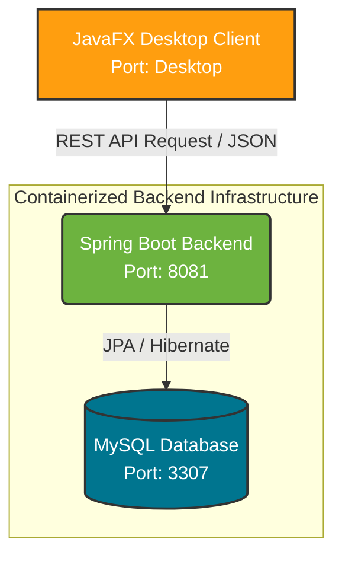

# 🎫 Support Ticketing System

A comprehensive, microservices-inspired support ticketing system designed to streamline the interaction between users reporting issues and the support staff resolving them. The system handles ticket creation, status tracking, and dynamic updates through a robust RESTful API and a native desktop interface.

---

## 🚀 Key Achievements & Features

* **Modular Architecture:** Designed with 3 distinct Maven modules (`support-backend`, `support-frontend`, and `support-database`) to ensure clean separation of concerns and maintainability. The shared `support-database` module provides entity definitions across the stack.
* **RESTful Communication:** The powerful Spring Boot backend exposes clean REST APIs to manage support tickets, which are seamlessly consumed by the frontend client utilizing Jackson for JSON processing.
* **Containerized Infrastructure:** Created a robust `docker-compose.yml` to seamlessly orchestrate the backend environment (MySQL database and Spring Boot Server), allowing for one-click cross-platform deployment.
* **Dedicated Desktop Client:** Built a responsive, native desktop application using **JavaFX** and FXML, providing tailored UX/UI experiences for viewing and managing tickets within the support ecosystem.
* **Secure Configurations:** Implemented strict `.env` usage to manage database credentials dynamically using Docker and Spring profiles without exposing sensitive data to version control.

---

## 📐 System Architecture

The ecosystem relies on an API-driven Spring Boot backend that communicates with a JavaFX desktop client and a containerized MySQL database.

---

## 🛠️ Tech Stack

**Backend:**
* **Java 17 & Spring Boot 2.7:** Core backend framework for building RESTful web services.
* **Spring Data JPA & Hibernate:** For ORM and seamless database interactions.
* **MySQL 8.0:** Relational database for persistent storage of ticket records.

**Frontend:**
* **JavaFX 17 & FXML:** Native desktop UI framework and markup language.
* **Jackson & org.json:** Libraries for consuming and parsing backend API JSON responses.

**DevOps & Deployment:**
* **Docker & Docker Compose:** Containerization and local orchestration of the database and backend services.
* **Maven:** Dependency management and build automation across multimodule architecture.
